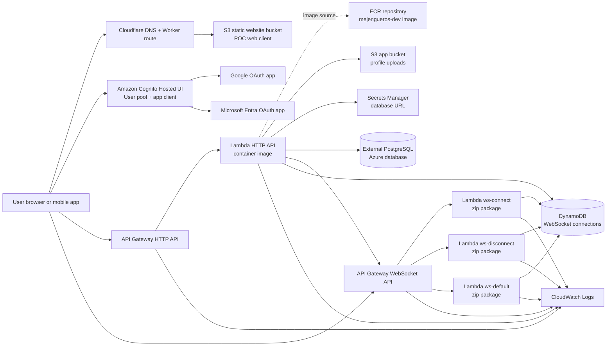
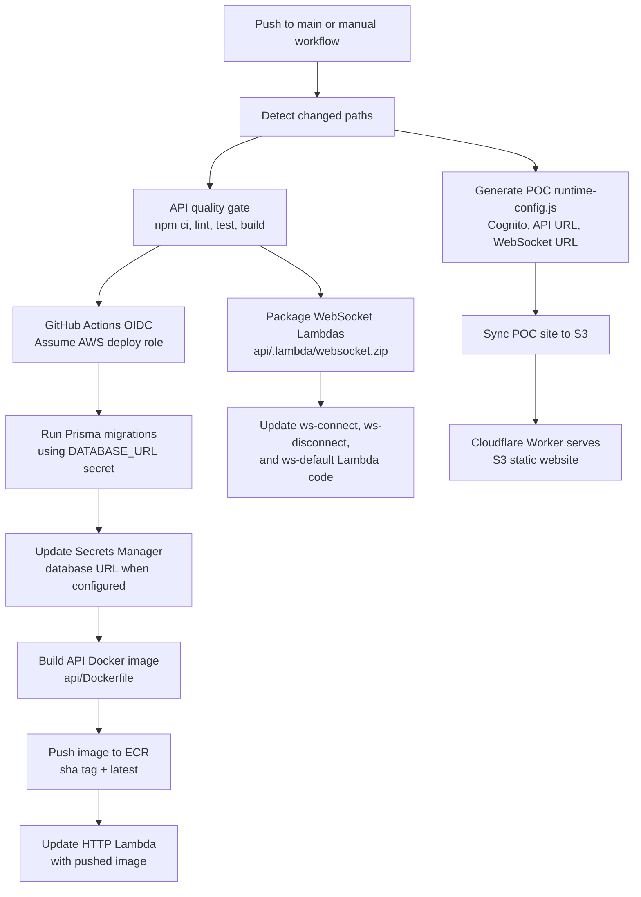

# Cloud Architecture

This document describes the current cloud architecture for the Mejengueros backend and POC web client.

## Runtime Architecture

## Deployment Flow

## Main AWS Resources

| Area | Resource | Purpose |
| --- | --- | --- |
| Identity | Cognito user pool, Hosted UI, app client | Social login through Google and Microsoft. |
| OAuth providers | Google OAuth app, Microsoft Entra app | External identity providers registered as Cognito IdPs. |
| HTTP API | API Gateway HTTP API | Public entry point for REST endpoints and Swagger. |
| API compute | Lambda container image | Runs the NestJS/Fastify API from an ECR image. |
| Image registry | ECR repository | Stores API Docker images tagged by commit SHA and `latest`. |
| Upload storage | S3 app bucket | Stores profile images under the environment upload prefix. |
| Database secret | Secrets Manager | Stores the external database connection string when enabled. |
| Database | External PostgreSQL | Application relational data. Currently not created by this Terraform stack. |
| Realtime | API Gateway WebSocket API | Public WebSocket endpoint. |
| Realtime compute | Three zip Lambdas | Handles `$connect`, `$disconnect`, and `$default` WebSocket routes. |
| Realtime state | DynamoDB table | Stores active WebSocket connections with TTL and query indexes. |
| Static POC | S3 static website bucket | Hosts the browser POC files. |
| DNS/proxy | Cloudflare DNS and Worker | Routes the public POC domain to the S3 website origin. |
| Observability | CloudWatch log groups | Stores API Gateway and Lambda logs with configured retention. |
| Deploy auth | GitHub OIDC IAM role | Lets GitHub Actions deploy without long-lived AWS keys. |

## ECR and Lambda Image Deployment

The HTTP API is deployed as a Lambda container image.

1. GitHub Actions assumes the AWS deploy role through OIDC.
2. The API quality gate runs lint, tests, and build.
3. The workflow builds `app-backend/api/Dockerfile`.
4. The image is pushed to ECR twice:
   - `${GITHUB_SHA}`
   - `latest`
5. The workflow calls `aws lambda update-function-code` with the commit SHA image URI.
6. Terraform keeps the base Lambda, IAM role, environment variables, ECR repository, API Gateway integration, and permissions under management.

Terraform derives the image URI from the ECR repository URL and `api_lambda_image_tag`. The workflow deploys the exact commit image after the infrastructure exists.

## WebSocket Deployment

The WebSocket handlers are deployed separately from the HTTP API image.

1. GitHub Actions builds the API package.
2. `npm run lambda:package:websocket` creates `app-backend/api/.lambda/websocket.zip`.
3. The zip is uploaded to:
   - `${project}-${env}-ws-connect`
   - `${project}-${env}-ws-disconnect`
   - `${project}-${env}-ws-default`
4. API Gateway WebSocket routes call the matching Lambda integrations.
5. Connection state is stored in DynamoDB and expires through the TTL attribute.

## Terraform Ownership

Terraform owns the long-lived infrastructure:

- Cognito, OAuth provider wiring, and Hosted UI domain.
- ECR repository.
- Lambda functions, IAM roles, and runtime environment variables.
- HTTP API and WebSocket API.
- S3 buckets for app uploads and POC hosting.
- DynamoDB WebSocket connections table.
- CloudWatch log groups and API Gateway access logs.
- GitHub Actions OIDC deploy role.
- Optional Cloudflare DNS and Worker route.
- Optional Microsoft Entra OAuth app.

The deploy workflow owns the mutable release artifacts:

- Docker image builds and ECR pushes.
- HTTP Lambda image code updates.
- WebSocket Lambda zip code updates.
- POC static file sync.
- Runtime config generation for the POC site.
