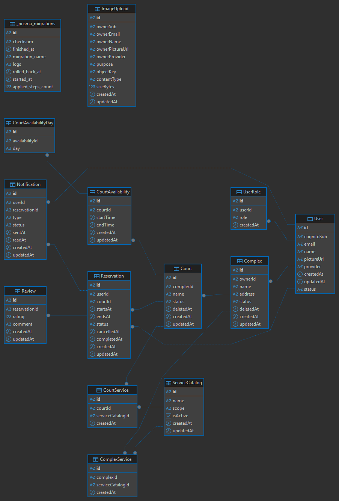

# Diagramas de base de datos

Esta carpeta contiene diagramas técnicos de base de datos y modelo relacional del proyecto.

## Milestone 1 — Esquema relacional MVP

Referencias:

- Issue: [#29 Implementar esquema relacional mínimo MVP](https://github.com/TheMonstersP4/mejengueros-app/issues/29)
- PR: [#70 feat(issue-29): add relational MVP schema](https://github.com/TheMonstersP4/mejengueros-app/pull/70)
